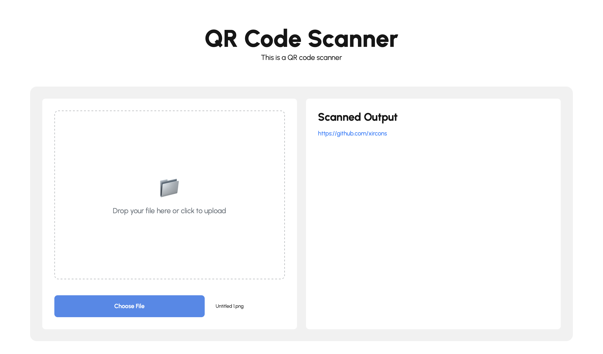

# QR Code Scanner

This project is a simple QR Code scanner built using HTML, CSS, and JavaScript. It allows users to upload an image containing a QR code and then decodes the content of the QR code. If the decoded text is a URL, it will be rendered as a clickable link.

## Features

- **Image Upload**: Easily upload images containing QR codes via file input or drag-and-drop.
- **QR Code Decoding**: Uses the jsQR library to decode the QR code from the image.
- **URL Detection**: Automatically identifies URLs in the decoded data and renders them as clickable links.

## Files in this Project

- `index.html`: The main HTML file that defines the structure and layout of the QR Code scanner interface.
- `style.css`: The stylesheet that styles the scanner's user interface.
- `script.js`: The JavaScript file that handles image uploads, QR code decoding using jsQR, and dynamic UI updates.

## Demo



## License & Credits

This project uses the [jsQR](https://github.com/cozmo/jsQR) library, which is licensed under the **MIT License**.

```
MIT License

Copyright (c) 2018-2021 Joshua Cooper

Permission is hereby granted, free of charge, to any person obtaining a copy
of this software and associated documentation files (the "Software"), to deal
in the Software without restriction, including without limitation the rights
to use, copy, modify, merge, publish, distribute, sublicense, and/or sell
copies of the Software, and to permit persons to whom the Software is
furnished to do so, subject to the following conditions:

[...]

THE SOFTWARE IS PROVIDED "AS IS", WITHOUT WARRANTY OF ANY KIND, EXPRESS OR
IMPLIED, INCLUDING BUT NOT LIMITED TO THE WARRANTIES OF MERCHANTABILITY,
FITNESS FOR A PARTICULAR PURPOSE AND NONINFRINGEMENT.
```
